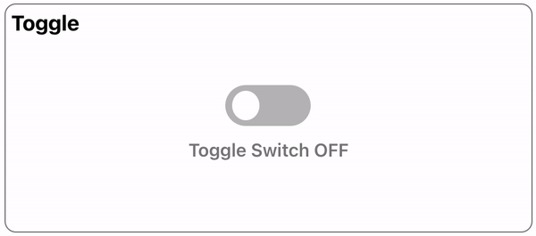
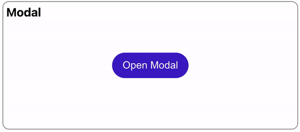
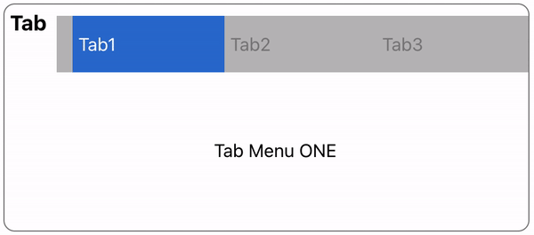
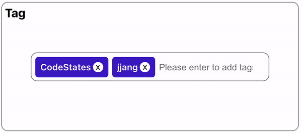
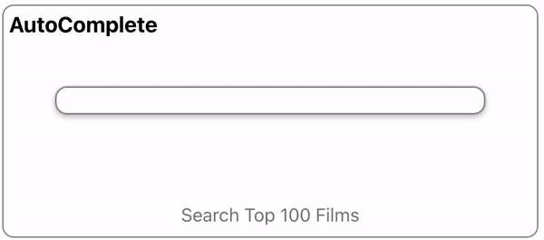
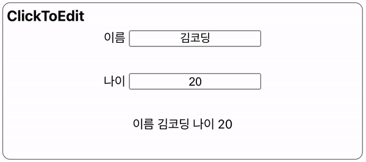

# 원티드 프리온보딩 프론트엔드 코스 과제

### Stack: React, PostCSS, Jest, HTML/CSS/Javascript
- 이 프로젝트에는 test 코드(unit test)가 있습니다.

### Heroku 배포 주소: https://wantedpreonboarding.herokuapp.com/

### 프로젝트 셋팅 및 실행방법

```
$ git clone https://github.com/heyjheyj/wanted_pre_onboarding.git
$ npm install
$ npm start
```

### 프로젝트 Test방법

```
$ npm run test
```

### 배포

```
$ npm run build
$ zip -r build.zip ./build
$ build.zip file을 원하는 서버에 배포
```

### 프로젝트 구조

```
├─src
│  ├─components
│  │      ├─AutoComplete
│  │      │   ├─data
│  │      │   ├─AutoComplete.jsx
│  │      │   └─AutoComplete.module.css
│  │      ├─ClickToEdit
│  │      │   ├─ClicktoEdit.jsx
│  │      │   └─ClickToEdit.module.css
│  │      ├─Modal
│  │      │   ├─Modal.jsx
│  │      │   └─Modla.module.css
│  │      ├─Tab
│  │      │   ├─Tab.jsx
│  │      │   └─Tab.module.css
│  │      ├─Tag
│  │      │   ├─section
│  │      │   │   ├─tagComponent.jsx
│  │      │   │   └─tagComponent.module.css
│  │      │   ├─Tag.jsx
│  │      │   └─Tag.module.css
│  │      └─Toggle
│  │         ├─Toggle.jsx
│  │         └─Toggle.module.css
│  │
│  └─App.jsx
```

## 주요기능

### 1. Toggle Switch



#### ✅ 구현기능 및 실행방법: Toggle Switch ON, OFF

- 구현기능 : OFF상태일 때는 Switch 내 배경이 회색으로, 아래 글씨가 OFF로 바뀌고, ON 상태일 때는 배경이 보라색(#431cc6)으로, 아래 글씨가 ON으로 나뀌도록 구현했습니다.
- 실행방법 : Toggle을 마우스로 클릭해 스위치를 ON, OFF합니다.

#### 💻 Error Handling Log: 토글 내 배경 처리 문제

- 토글하면 배경색 전체가 한번에 바뀌는 것이 아니라, 버튼 이동에 맞춰 바뀌도록 구현하는 것이 어려웠습니다.
  switch와 토글 inner색상을 따로 만들어 동시에 이동하도록 만들었고, 이 둘을 label로 감싸 box를 만들고 overflow hidden으로 처리했습니다. 이후 css transition으로 switch가 자연스럽게 움직이도록 했습니다.

---

### 2. Modal



#### ✅ 구현기능 및 실행방법: 버튼 클릭시 문구와 닫기 버튼이 있는 Modal이 열림

- 구현기능 : 1) Modal창을 열 수 있도록 클릭버튼을 생성했습니다. 2) 클릭하면 부모컴포넌트의 width, height 전부를 쓰는 Modal이 열리도록 하고, component 내용은 center에 배치했습니다. 3) Modal은 버튼 'x'을 클릭하면 닫을 수 있도록 구현했습니다.

- 실행방법: 'Open Modal' 버튼을 누르면 Modal창이 열리고, Modal창은 클릭으로 닫을 수 있습니다.

---

### 3. Tab



#### ✅ 구현기능 및 실행방법: tab을 클릭하면 tab의 배경색과 문구가 달라짐

- 구현기능: 1) 각 tab을 클릭하면 배경이 보라색으로 변경됩니다.(transition이용) 2) 아래 문구는 각 tab 클릭시 tab1은 ONE으로, tab2는 TWO로, tab3은 THREE로 변경되도록 했습니다.
- 실행방법: tab에 마우스 hover시 cursor가 변경됩니다. 각 tab을 클릭하면 배경과 문구가 동시에 바뀝니다.

#### 💻 Error Handling Log

- 클릭 이벤트가 발생하면 배경색과 문구가 동시에 바뀌도록 처리하는 것이 까다로웠습니다.
  current tab이 어떤 것인지에 따라 색상이 변경되도록하고 문구도 동시에 바뀔 수 있도록 index를 이용해 랜더링했습니다.

---

### 4. Tag



#### ✅ 구현기능 및 실행방법: input을 통해 tag를 등록하고, tag내에 있는 버튼을 이용해 해당 tag를 삭제

- 구현기능: 1) input에 tag내용을 입력하면 tag내용이 tags영역에 등록되고, tag생성시 함께 생성되는 버튼'x'를 이용해 해당 tag를 삭제할 수 있도록 했습니다. 2) tag가 일정영역 이상 등록되면 스크롤이 생기도록 했습니다.
- 실행방법: 'Please enter to add tags'영역에 tag로 등록하고자 하는 문구를 넣고 엔터를 치면 tag내용이 등록됩니다. tag는 'x'버튼과 함께 생성되는데, 버튼을 클릭하면 해당 tag가 삭제됩니다.

#### 💻 Error Handling Log: css의 어려움

- 프론트엔드를 공부하면서 시간이 갈수록 어렵다고 느껴지는 부분이 제게는 css입니다. 고려해야할 요소도 많고 사용할 수 있는 기능도 많아, 많은 시간을 투자하지 않으면 절대 능숙해지지 않을 것 같다고 생각합니다.
  Tag는 일종의 todolist와 비슷해 기능을 구현하는 데는 큰 어려움이 없었지만, 각 박스들의 width와 flex-wrap을 이용한 배치 등을 적용하는게 까다로웠습니다.
- tag 등록시 랜덤으로 색이 지정되도록도 시도해봤습니다.

.gif>)

---

### 5. Auto Complete



#### ✅ 구현기능 및 실행방법: input에 일부 검색어를 넣으면 자동완성으로 일부 검색어가 포함된 결과값을 보여줌

- 구현기능

1. input에 검색어 일부를 넣으면 자동완성으로, 일부 검색어가 포함된 결과를 추천합니다.
2. 추천검색어가 3개 이상일 경우 스크롤이 생깁니다.
3. input이 Focus되는 순간 isAutoCompleting이 true로 변경되면서 'x'button생성, 자동완성 기능이 rendering됩니다.
4. 추천검색어에 마우스를 hover하면 해당 검색어의 배경색이 변경됩니다.
5. 추천검색어를 클릭하면 input 값으로 세팅됩니다.
6. input Focus시 생성되는 'x'버튼을 클릭하면 자동완성과 input값이 초기값으로 세팅됩니다.

- 실행방법

1. input값에 검색하고자 하는 검색어의 일부를 타이핑합니다.
2. 일부 검색어를 포함한 추천검색어가 input아래 디스플레이됩니다.
3. 찾고자 하는 검색어를 클릭하면 input 값으로 세팅됩니다.
4. 다른 검색어를 찾고 싶다면 input 박스 가장 오른쪽에 보이는 'x'버튼을 클릭해 모두 초기화합니다.

#### 💻 Error Handling Log1: input이 blur 됐을 때 자동완성이 닫히도록 구현하기

- 자동완성이 닫히지 않는 문제: 자동완성은 li태그들을 ul태그로 묶어 랜더링 해줬습니다. 자동완성 검색어를 클릭해서 input의 value값을 세팅해주는 방식인데 이 부분은 문제없이 동작했습니다. 그러나 검색어를 입력한 뒤 자동완성 검색어를 클릭하지 않은 상태에서, input과 자동완성 외부에서 클릭이벤트가 발생했을 때 자동완성이 닫히지 않는 문제가 발생했습니다.
- onBlur 이벤트 적용해보기: 문제 해결을 위해 처음에는 input에 blur이벤트를 적용했습니다. 즉 input이 클릭이 되면 isAutoCompleting이 true가 되면서 자동완성이 보여지고, blur가 됐을 때 isAutoCompleting이 false가 되어 자동완성이 보여지지 않도록 처리했습니다. 그런데 이럴경우 li태그를 클릭했을 때 blur이벤트가 먼저 적용돼 li태그에 클릭이벤트가 먹히지 않는 문제가 발생해서 다른 방법을 강구해야 했습니다.
- 클릭이벤트 제어: onBlur가 input과 자동완성에서만 일어나지 않도록 하면 되지 않을까?하는 생각에 이 둘을 감싸고 있는 부모태그에 ref를 걸어줬습니다. 그리고 클릭이벤트가 발생했을 때 이 부모태그를 제외한 다른 곳에서 클릭이 발생했을 때에만 isAutoCompleting을 false로 처리하도록 조건을 달았습니다. 결과적으로 동작이 잘 됐습니다.
- 닫기버튼은 이 기능에 더해 input값을 초기화하는 것까지 기능을 더 했습니다.

#### 💻 Error Handling Log2: 검색어 sorting문제

- 검색어 sorting이 안되는 문제: 단순 문자들로만 만들어진 배열 자료를 이용헸다면 sorting이 쉬웠을텐데, key와 value가 2개씩 담긴 객체들이 있는 배열을 데이터로 이용해서 sorting하는 부분에 문제가 생겼습니다.
- MDN에서 찾아 적용 : mdn사이트에 arrays of objects는 속성값 중 하나의 value를 비교하는 방식으로 sorting할 수 있다고 나와 있어 예제에 있던 함수를 적용해봤습니다. 실제로 잘 동작했습니다.

---

### 6. Click To Edit



#### ✅ 구현기능 및 실행방법: input box를 클릭해 내용을 수정하면, 가장 아래 문구가 함께 변경

- 구현기능 : 1) input box의 focus, blur 이벤트를 이용해 내용을 수정하고 state를 업데이트 할 수 있도록 했습니다. 2) focus되는 input은 border style을 변경하도록 했습니다.

- 실행방법: 1) 이름, 나이 label 혹은 input을 클릭하면 내용을 변경할 수 있습니다. 2) 원하는 input 값을 넣습니다. 3) input 태그 밖 영역을 마우스로 클릭하면 값이 업데이트 됩니다. 4) 값이 업데이트 되면 하단의 문구가 변경됩니다.

#### 💻 Error Handling Log: blur가 될 때 내용 저장하기

- 보통 input으로는 onChange로 state를 업데이트 하고 서버와 통신하는 로직을 많이 구현했는데 이번에는 input이 blur처리가 될 때 상태를 업데이트 하도록 했습니다. focus가 되면 class가 변경되도록 해 CSS 효과를 줬습니다.
